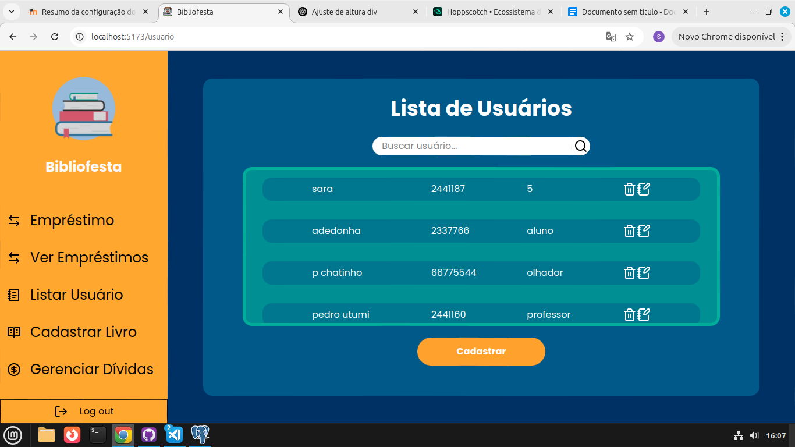

# Bibliofesta Frontend

## 🚀 Descrição do Projeto
Frontend da nossa biblioteca **"Bibliofesta"**, com uso das ferramentas Javascript **React Vite**, **React-Router** e **PostgreSQL** como banco de dados

## 💻 Tecnologias Utilizadas
- 
- 
- 

## 📊 Status do Projeto
- [ ] 🚫 Não Feito
- [x] 🔄 Em Andamento
- [ ] ✅ Concluído

## 📁 Estrutura do Projeto
```
├── public/ 
├──src/
│
    ├── assets/                     
    │
    ├── components/                
    │   ├── Menu.jsx         
    │   └── Pagina.jsx  
    │
    ├── context/                
    │   └── DadosContext.jsx  
    │
    ├── pages/                      
    │   ├── AtualizarLivro.jsx         
    │   └── AtualizarUsuario.jsx  
    │   └── Cadastro.jsx  
    │   └── CadastroLivro.jsx         
    │   └── CadastroUsuario.jsx  
    │   └── Emprestimo.jsx                   
    │   └── Emprestimo2.jsx         
    │   └── Emprestimo3.jsx  
    │   └── GerenciarDividas.jsx
    │   └── Login.jsx              
    │   └── Usuario.jsx             
    │   └── VerificarEmprestimos.jsx              
    ├── index.css                  
    ├── main.jsx 
├── .gitignore
├── eslint.config.js
├── index.html
├── package-lock.json                   
├── package.json                   
├── README.md                   
└── vite.config.js      
```
## 🛠️ Instalação e Execução
- Clone o repositório e abra um terminal nele
```
git clone https://github.com/PedrinnhoUtumi/Bibliofesta.git

cd Bibliofesta
```
- Instale suas dependências
```
npm i
```
ou
```
npm install
```
- Execute o Site (Ele se localizará em http://localhost:5173/)
```
npm run dev
```

## 🧑‍💼 Integração com a API
Este site foi projetado para comunicar-se com o backend TrabalhoBiblioteca, disponivel em [TrabalhoBiblioteca](https://github.com/PedrinnhoUtumi/TrabalhoBiblioteca), então, certifique-se de que o backend esteja rodando corretamente em http://localhost:3000 para dar inicio ao projeto.

## ˖°📷༘ Exemplo de uso


## 👥 Integrantes
- [Sara Guaiume](https://github.com/saraqwe123) -> emprestimo, emprestimo2, emprestimo3, cadastroLivro, cadastroUsuario, Usuario, VerificarEmprestimos
- [Pedro Utumi](https://github.com/PedrinnhoUtumi/) -> AtualizarUsuario, Cadastro, Login, DadosContext, README